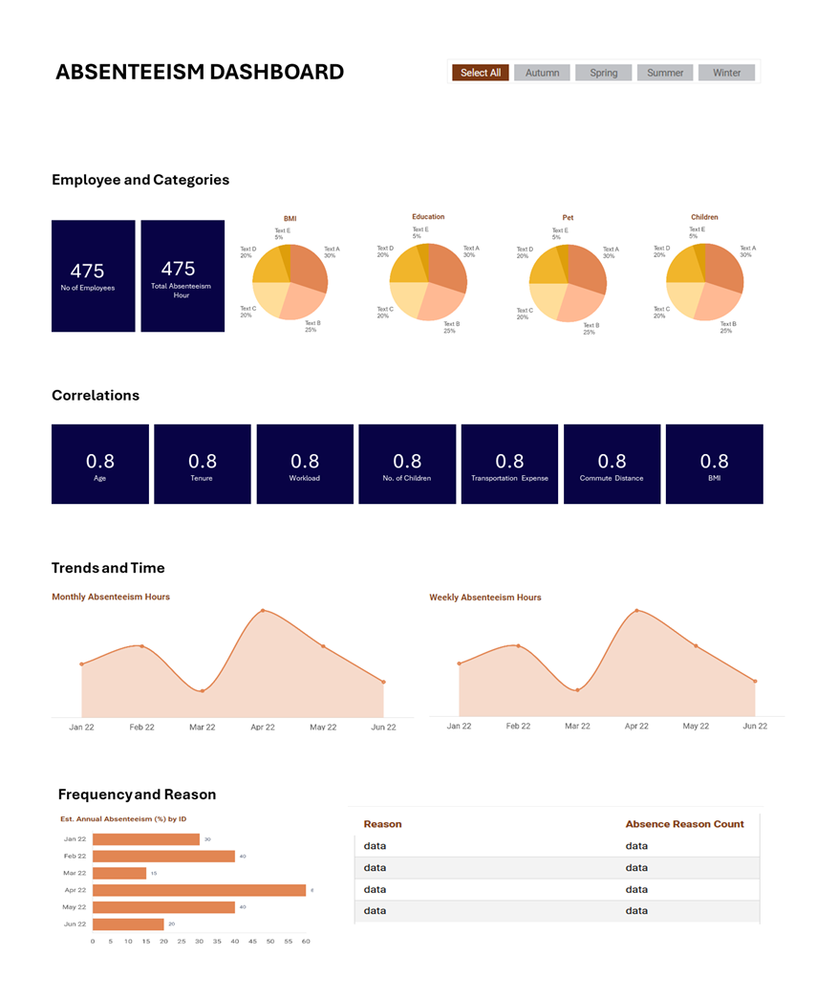

# Optimising Employee Wellness with Data


## Table of Contents
- [Objective](#objective)
- [User Story](#user-story)
- [Data Source](#data-source)
- [Stages](#stages)
- [Design](#design)
  - [Dashboard Mockup](#dashboard-mockup)
  - [Tools](#tools)
- [Development](#development)
  - [Data Analysis Pipeline](#data-analysis-pipeline)
  - [Initial Data Observations](#initial-data-observations)
  - [SQL View Creation](#sql-view-creation)
- [Testing](#testing)
  - [Data Quality Checks](#data-quality-checks)
- [Visualisation](#visualisation)
  - [Dashboard](#dashboard)
  - [DAX Measures](#dax-measures)
- [Analysis](#analysis)


## Objective
Enhance employee wellness and reduce absenteeism through data-driven incentive programs and cost-effective insurance strategies.

### Challenge
HR lacks a quantitative approach to identifying healthy employees and those with low absence for reward programs. Furthermore, there is no systematic way to optimising insurance costs based on employee health considerations.

### Solution
Develop a data analysis framework to:
- Provide a list of employees who meet the criteria for good health and low absenteeism for a health bonus program, with a total budget of $1,000 USD.
- Determine the wage increase or annual compensation for non-smokers using an insurance budget of $983,221 allocated for all non-smoking employees.
- Create a Dashboard for HR to understand absenteeism at work based on approved wireframe.

### Benefits
Improved employee health and morale through targeted incentives, reduced absenteeism rates, reduced healthcare costs through optimised insurance premiums, and data-driven insights to inform future wellness strategies.


## User Story
As an HR manager, I want to identify and reward healthy employees with low absenteeism to improve overall workforce well-being and reduce costs associated with absenteeism. I also want to understand the cost implications of offering wage increases to non-smokers so that I can optimise our insurance budget. To achieve this, I require a visual representation of absenteeism trends to evaluate the effectiveness of our wellness initiatives.


## Data Source
To achieve our objective, we need HR data on employees that include:
- Employee records
- Tracked absences
- Compensation
The data is sourced from [Absent Data](https://absentdata.com/data-analysis/where-to-find-data/) (csv extract).

### Data Elements
The data needed to achieve the objective includes:
- Employee ID
- Social drinker
- Social smoker
- Body mass index
- Reason for absence
- Absenteeism time in hours
- Number of children
- Education
- Number of pet 


## Stages
1. Design
2. Development & Implementation
3. Testing


## Design
Required Dashboard Components

To determine the necessary components for the dashboard, we must identify the questions it will need to answer. 

**Overall Absenteeism Trends:**
- What is the overall absenteeism rate over time?
- Are there seasonal trends or patterns in absenteeism?

**Reasons for Absenteeism:**
- What are the most common reasons for absenteeism?
- Are there any emerging trends in the reasons for absence?

**Employee Absenteeism:**
- Which employees have the highest absenteeism rates?
- Are there any factors (e.g. age, workload, number of children) correlated with employee absenteeism?

### Dashboard Mockup
The dashboard will consist of several visual elements to answer the questions listed above:
1.	Pie chart
2.	Line chart
3.	Bar chart
4.	Scorecards
5.	Table 




### Tools
The project utilises a combination of the following tools:
- **Excel**: Initial data exploration.
- **SQL Server**: For data cleaning, data quality tests, and analysis.
- **Power BI**: Primary tool for creating interactive visualisations and the final dashboard.
- **GitHub**: Hosting project documentation, code, and version control.
- **Mokkup AI**: Designing a wireframe/mockup for the dashboard layout.


## Development
### Data Analysis Pipeline

1.	Get the data
2.	Import data into SQL Server.
3.	Explore the data.
4.	Test the data to ensure accuracy and completeness.
5.	Calculate the eligible employees for health bonus and annual compensation increase for non-smokers.
6.	Connect Power BI to database for visualisation
7.	Create DAX measures to calculate additional metrics relevant for analysis.
8.	Build interactive data visualisations.


### Initial Data Observations

The initial exploration reveals several key observations:
- The data comes with 3 tables needed for analysis.
- The data has no null or missing values.
- The HR department may be helpful in providing relevant data that can be useful for analysis like dates, gender.

### SQL View Creation

```sql
/* 
# DATA PREP AND VIEW CREATION STEPS 
1. Clean up the Data: remove irrelevant columns by only keeping the ones needed from the original tables.
2. Create categorical data from Body_mass_index and Seasons columns.
3. Create a view of the relevant columns and rows.
*/

CREATE VIEW view_work AS 
SELECT
	aw.ID,
	r.Reason,
	Month_of_absence, 
	Body_mass_index,
	Seasons,
	CASE
		WHEN Body_mass_index < 18.5 THEN 'Underweight'
		WHEN Body_mass_index BETWEEN 18.5 AND 24.9 THEN 'Healthy weight'
		WHEN Body_mass_index BETWEEN 25 AND 29.9 THEN 'Overweight'
		WHEN Body_mass_index >= 30 THEN 'Obese'
		ELSE 'Unknown'
	END AS BMI_Category,
	CASE
		WHEN Month_of_absence IN (12,1,2) THEN 'Winter'
		WHEN Month_of_absence IN (3,4,5) THEN 'Spring'
		WHEN Month_of_absence IN (6,7,8) THEN 'Summer'
		WHEN Month_of_absence IN (9,10,11) THEN 'Autumn'
		ELSE 'Unknown'
	END AS Season_Names,
	Service_time,
	Day_of_the_week,
	Transportation_expense,
	Education,
	Son,
	Social_drinker,
	Social_smoker,
	Pet,
	Disciplinary_failure,
	Age,
	Work_load_Average_day,
	Absenteeism_time_in_hours
FROM 
	work_db..Absenteeism_at_work aw
LEFT JOIN work_db..compensation c ON
	aw.ID = c.ID
LEFT JOIN work_db..Reasons r ON
	aw.Reason_for_absence = r.Number;
```


## Testing
### Data Quality Checks
Here are some of the key checks performed:

1. Row count validation
2. Column count validation
3. Data type validation 
4. Uniqueness validation


**SQL Query**
```sql
/*
# DATA QUALITY CHECKS
	1. Row Count Validation: the total number of records in the dataset must be 740.
	2. Column Count Validation: the number of columns in the dataset must be 18 fields.
	3. Data Type Validation: the columns must have appropriate fields.
	4. Uniqueness Validation: each record must be unique in the dataset.
*/

-- 1. Row Count Validation
SELECT
	COUNT(*) AS row_count
FROM
	work_db..view_work;


-- 2. Column Count Validation
SELECT
	COUNT(*) AS column_count
FROM
	INFORMATION_SCHEMA.COLUMNS
WHERE
	TABLE_NAME = 'view_work';


-- 3. Data Type Validation
SELECT
	COLUMN_NAME,
	DATA_TYPE
FROM
	INFORMATION_SCHEMA.COLUMNS
WHERE
	TABLE_NAME = 'view_work';


-- 4. Uniqueness Validation
SELECT *
FROM (
    SELECT
        ID,
        ROW_NUMBER() OVER (PARTITION BY ID ORDER BY ID) AS row_num
    FROM
        work_db..view_work
) AS Duplicates
WHERE row_num > 1;

```


**Results**


## Visualisation
### Dashboard


### DAX Measures
#### 1. Estimated Annual Absenteeism (%)
<pre>
<code>
EstPercOfDaysAbsent = 
VAR DailyHours = 8
VAR DaysAbsent = DIVIDE([TotalAbsenteeism], DailyHours)
VAR AverageWorkdaysPerMonth = 22 // This is an estimate, as it doesn't allow for possible differences in the number of workdays per month.
VAR MonthsInAYear = 12
VAR AvgHolidayPerYear = 34 // for employees in the UK, inclusive of bank holidays
VAR TotalWorkDays = (AverageWorkdaysPerMonth * MonthsInAYear) - AvgHolidayPerYear
RETURN
    DIVIDE(DaysAbsent, TotalWorkDays) * 100
</code>
</pre>


#### 2. Week Name
```sql
WeekName = 
SWITCH(
    'view_work'[Day_of_the_week],
    2, "Mon",
    3, "Tue",
    4, "Wed",
    5, "Thu",
    6, "Fri",
    "0"
)
```

#### 3. Month Name
```sql
MonthName = 
SWITCH(
    'view_work'[Month_of_absence],
    1, "Jan",
    2, "Feb",
    3, "Mar",
    4, "Apr",
    5, "May",
    6, "Jun",
    7, "Jul",
    8, "Aug",
    9, "Sep",
    10, "Oct",
    11, "Nov",
    12, "Dec",
    "0"
)
```

#### 4. Correlation
(Age, BMI, Distance from residence to work, Tenure, Number of Children, Transport expense, Average daily work load) vs Absenteeism
```sql
Correlation_Age_Absenteeism = 
VAR MeanX = AVERAGE('view_work'[Age])
VAR MeanY = AVERAGE('view_work'[Absenteeism_time_in_hours])
VAR Numerator = SUMX('view_work', ('view_work'[Age] - MeanX) * ('view_work'[Absenteeism_time_in_hours] - MeanY))
VAR Denominator = SQRT(SUMX('view_work', ('view_work'[Age] - MeanX)^2) * SUMX('view_work', ('view_work'[Absenteeism_time_in_hours] - MeanY)^2))
RETURN DIVIDE(Numerator, Denominator)
```


## Analysis
### Eligible Employees for Health Bonus
```sql
/* Eligible Employees for Health Bonus

NOTE: HR did not give criteria for what they consider as 'good health'
Direct health indicators include:
	- Body mass index (BMI): A common measure of weight in relation to height that is usually used as an indicator for general health.
	- Social smoker: Smoking is linked to various health issues.
	- Social drinker: Excessive alcohol consumption can impact health.

Indirect health indicators (lifestyle and behaviours) include:
	- Absenteeism time in hours: Lower absenteeism rates generally correlate with better health.
	- Reason for absence: Frequent absences due to illness might indicate poorer health.
*/

SELECT *
FROM
	work_db..view_work
WHERE
	Body_mass_index BETWEEN 18.5 AND 24.9
	AND Social_smoker = 0
	AND Social_drinker = 0
	AND Absenteeism_time_in_hours < (
		SELECT AVG(Absenteeism_time_in_hours)
		FROM work_db..view_work
	);
```

### Annual Compensation Increase for Non-Smokers
```sql
/* Annual Compensation Increase for Non-Smokers (Budget = $983,221)
1. Define any variables needed for calculations
2. Create a Common Table Expression (CTE) to calculate the number of non smokers
3. Create calculated columns
*/

DECLARE @insuranceBudget MONEY = 983221.0;	-- insurance budget allocated for all non-smokers
DECLARE @hoursPerYear INT = 2080;			-- 8 hours x 5 days x 52 weeks

WITH nonSmokers AS (
	SELECT 
		COUNT(*) AS non_smokers
	FROM
		work_db..view_work
	WHERE
		Social_smoker = 0
)

SELECT
	non_smokers,
	non_smokers * @hoursPerYear AS hours_by_non_smokers_per_year,
	@insuranceBudget / (non_smokers * @hoursPerYear) AS increment_per_hour,
	(@insuranceBudget / (non_smokers * @hoursPerYear)) * @hoursPerYear AS annual_compensation_increase
FROM
	nonSmokers;
```
